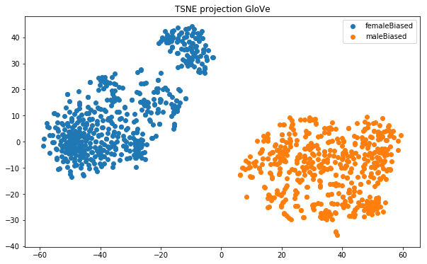
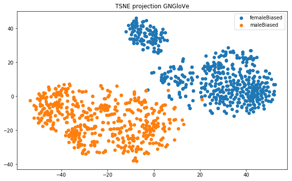

# Lipstick on a Pig: Debiasing Methods Cover up Systematic Gender Biases in Word Embeddings But do not Remove Them

This repositore reproduces the results in the paper titled [Lipstick on a Pig](https://arxiv.org/abs/1903.03862) for GloVe and Gn-GloVe embeddings. This paper introduces a new definition of bias, bias my neighbourhood of other biased words, and shows that it correlated with bias by projection on gender subspace(earlier definition) proposed by [Bolukbasi](https://arxiv.org/abs/1607.06520). It shows that as seen by this new metric bias is not removed and female biased words cluster with other female biased words and vice versa. Hence current debiasing techniques which use the earlier definiton are insufficient.

As stated by the paper, preprocessing steps were:
- take the most frequent 50,000 words and phrases
- remove words with upper-case letters, digits, or punctuation.
- words longer than 20 characters
- remove gender specific words given [here](https://github.com/uclanlp/gn_glove/tree/master/wordlist)

### GloVe

Kmeans clustering can separate them with accuracy of 100%. [Code here](https://github.com/muaz-urwa/Lisptic-on-a-Pig-Word-Embedding-Bias-unofficial-code/blob/master/Bias%20by%20Clustering.ipynb)

### Gn-GloVe

Kmeans clustering can separate them with accuracy of 85.7%. [Code here](https://github.com/muaz-urwa/Lisptic-on-a-Pig-Word-Embedding-Bias-unofficial-code/blob/master/Bias%20by%20Clustering.ipynb)
